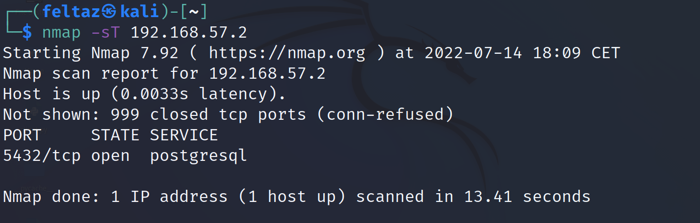

# [Snort IPS](www.snort.org)

# Introduction
This Document takes you step by step in configuring Snort2 as an Intrusion Prevention System for your host or Network   
   

# Table Of Content  

- [Snort IPS](#snort-ips)
- [Introduction](#introduction)
- [Table Of Content](#table-of-content)
- [Dependencies](#dependencies)
- [DAQ](#daq)
  - [What is it?](#what-is-it)
  - [installing libdaq](#installing-libdaq)
- [Installing Snort](#installing-snort)
  - [Compiling snort from Source](#compiling-snort-from-source)
  - [Ensure Snort is installed Correctly](#ensure-snort-is-installed-correctly)
- [Configuring Snort](#configuring-snort)
  - [Creating snort group and user](#creating-snort-group-and-user)
  - [Creating necessary Files and folders](#creating-necessary-files-and-folders)
  - [Modifying snort configuration](#modifying-snort-configuration)
  - [Setting up Systemd Script for Snort](#setting-up-systemd-script-for-snort)
  - [Adding iptables NFQ Rules](#adding-iptables-nfq-rules)
    - [Why do we need to add nfq rules?](#why-do-we-need-to-add-nfq-rules)
    - [Setting up persistant rules in iptables](#setting-up-persistant-rules-in-iptables)
  - [Ansible playbook for automating snort deployment and configuration](#ansible-playbook-for-automating-snort-deployment-and-configuration)
- [Snort Rules](#snort-rules)
  - [Local Rules locations](#local-rules-locations)
  - [Basic rule Syntax](#basic-rule-syntax)
    - [Rule headers](#rule-headers)
      - [rule action](#rule-action)
      - [protocol](#protocol)
      - [Source destination ip](#source-destination-ip)
      - [Ports](#ports)
      - [Direction of the rule](#direction-of-the-rule)
    - [Rule Options](#rule-options)
      - [General rule options keywords](#general-rule-options-keywords)
      - [Payload rule options keywords](#payload-rule-options-keywords)
      - [Non-Payload Detection Rule Options](#non-payload-detection-rule-options)
      - [Post-Detection Rule Options](#post-detection-rule-options)
      - [Rule Example](#rule-example)
  - [Downloading Community/Registered user Rules](#downloading-communityregistered-user-rules)
    - [introduction](#introduction-1)
    - [How to use community/Registered user Rules](#how-to-use-communityregistered-user-rules)
    - [Applying the new Registered User rules](#applying-the-new-registered-user-rules)
    - [Automating the process of updating Rules](#automating-the-process-of-updating-rules)
- [Snort Preprocessors](#snort-preprocessors)
  - [What are preprocessors?](#what-are-preprocessors)
  - [Available Snort preprocessors](#available-snort-preprocessors)
  - [Configuring Preprocessors](#configuring-preprocessors)
    - [Preprocessor Documentation](#preprocessor-documentation)
    - [Enabling Preprocessors](#enabling-preprocessors)
  - [Using Preprocessors](#using-preprocessors)
    - [sfPortscan example](#sfportscan-example)
      - [What is sfportscan ?](#what-is-sfportscan-)
      - [Generating Alerts for portscan](#generating-alerts-for-portscan)
      - [Testing sfportscan](#testing-sfportscan)
- [Conclusion](#conclusion)


# Dependencies   
Most software (snort included) depend on some external libraries and packages that developpers reuse for specific purposes in order to not rewrite code that has been already written by someone else.  
Here is a list of all the dependencies needed for Snort:
- build-essential
- flex
- bison
- libpcap-dev
- libdnet-dev
- libdumbnet-dev
- libntirpc-dev
- libpcre3-dev
- libluajit-5.1-dev
- libssl-dev
- luajit
- zlib1g-dev
- liblzma-dev
- openssl
- libnghttp2-dev
- libnetfilter-queue-dev

On debian Based Hosts you can use this command to install all of the above:  
```
sudo apt update && sudo apt install build-essential flex bison libpcap-dev libdnet-dev libdumbnet-dev libntirpc-dev libpcre3-dev libluajit-5.1-dev libssl-dev luajit zlib1g-dev liblzma-dev openssl libnghttp2-dev libnetfilter-queue-dev
```


# DAQ 
## What is it? 
DAQ  or The Data AcQuisition Library is a pluggable abstraction layer for interacting with a data source (traditionally a network interface or network data plane)
## installing libdaq
First of all we need the source code for the daq, we can download the latest version from the official [snort website](www.snort.org).  
extract the contents of the tar archive using this command in the directory of your choice:   
`tar xvf daq-<VERSION>.tar.gz`   
change to the directory:   
`cd daq-<VERSION>`
and then execute the following (with root privileges):   
`./configure `

you should see the following output:
```
Build AFPacket DAQ module.. : yes
Build Dump DAQ module...... : yes
Build IPFW DAQ module...... : yes
Build IPQ DAQ module....... : no
Build NFQ DAQ module....... : yes  <<<<< MUST BE YES
Build PCAP DAQ module...... : yes
Build netmap DAQ module.... : no

```

It is crucial that the NFQ module must be built in order for snort to work in inline mode (Intrusion prevention).

if everything checks out you can run (with root privileges):  
`make && make install`


# Installing Snort
## Compiling snort from Source
Download the Snort source code from the [official snort website](www.snort.org) and extract the contents from the tar archive using the following command:  
`tar xvf snort-<VERSION>.tar.gz`
change to the directory using:  
`cd snort-<VERSION>`  and then execute the following (with root privileges):  
`./configure --enable-sourcefire`  
If you have installed the required Dependencies without issue you should see no error in your output.  
You can then proceed by compiling the source code with:  
`make && make install`   

---  

WARNING:  
Sometimes when you compile snort an error occurs telling you that it didn't find certain header files and those specific files belong to the ntirpc library all you need to do is copy the contents of  /usr/include/ntirpc/* to  /usr/include/ directory  use this command:  
`cp -r /usr/include/ntirpc/* /usr/include/`  

And then rerun:  
`make && make install`  
in the snort source directory

---  
## Ensure Snort is installed Correctly
Last thing to do to ensure that snort works perfectly fine is to update the shared libraries using this command:  
`ldconfig`  

If everything goes as planned run the following:     
`snort --version`  
and you should see the following:  
```
   ,,_     -*> Snort! <*-
  o"  )~   Version 2.9.20 GRE (Build 82) 
   ''''    By Martin Roesch & The Snort Team: http://www.snort.org/contact#team
           Copyright (C) 2014-2022 Cisco and/or its affiliates. All rights reserved.
           Copyright (C) 1998-2013 Sourcefire, Inc., et al.
           Using libpcap version 1.10.1 (with TPACKET_V3)
           Using PCRE version: 8.39 2016-06-14
           Using ZLIB version: 1.2.11

```
Ensure that you can use the NFQ DAQ module using this command:  
`snort --daq-list`  
and you should see NFQ listed among the daq that snort can use like so:  
```
Available DAQ modules:
pcap(v3): readback live multi unpriv
nfq(v7): live inline multi       <<<<<<  Need this line
ipfw(v3): live inline multi unpriv
dump(v3): readback live inline multi unpriv
afpacket(v5): live inline multi unpriv
```
# Configuring Snort 
## Creating snort group and user
First of all for security reasons we want snort to run with a system user's privileges so we should create a snort group and user:  
```
#create the snort group
groupadd snort

#create the snort system user
useradd snort -r -s /sbin/nologin -c SNORT_IDS -g snort
```  
## Creating necessary Files and folders
Then we need to create certain files and directories that snort expects to be present in order to run in IPS mode 
```

# Create the Snort directories:
sudo mkdir /etc/snort
sudo mkdir /etc/snort/rules
sudo mkdir /etc/snort/rules/iplists
sudo mkdir /etc/snort/preproc_rules
sudo mkdir /usr/local/lib/snort_dynamicrules
sudo mkdir /etc/snort/so_rules
 
# Create some files that stores rules and ip lists
sudo touch /etc/snort/rules/iplists/black_list.rules
sudo touch /etc/snort/rules/iplists/white_list.rules
sudo touch /etc/snort/rules/local.rules
sudo touch /etc/snort/sid-msg.map
 
# Create our logging directories:
sudo mkdir /var/log/snort
sudo mkdir /var/log/snort/archived_logs
 
# Adjust permissions:
sudo chmod -R 5775 /etc/snort
sudo chmod -R 5775 /var/log/snort
sudo chmod -R 5775 /var/log/snort/archived_logs
sudo chmod -R 5775 /etc/snort/so_rules
sudo chmod -R 5775 /usr/local/lib/snort_dynamicrules
 
# Change Ownership on folders:
sudo chown -R snort:snort /etc/snort
sudo chown -R snort:snort /var/log/snort
sudo chown -R snort:snort /usr/local/lib/snort_dynamicrules

```

Then we need to copy files from the extracted snort source tarball to the configuration folder:  
```
cd <PATH_TO_SNORT_SOURCE>/etc/
sudo cp *.conf* /etc/snort
sudo cp *.map /etc/snort
sudo cp *.dtd /etc/snort
 
cd <PATH_TO_SNORT_SOURCE>/src/dynamic-preprocessors/build/usr/local/lib/snort_dynamicpreprocessor/
sudo cp * /usr/local/lib/snort_dynamicpreprocessor/
```

## Modifying snort configuration 
It is probably a good practice to mention the full path of the rules directory in the configuration file you can edit the first section relative to the network variables in /etc/snort/snort.conf using your favourite editor:

```

# Path to your rules files (this can be a relative path)
# Note for Windows users:  You are advised to make this an absolute path,
# such as:  c:\snort\rules
var RULE_PATH /etc/snort/rules
var SO_RULE_PATH /etc/snort/so_rules
var PREPROC_RULE_PATH /etc/snort/preproc_rules

# If you are using reputation preprocessor set these
var WHITE_LIST_PATH /etc/snort/rules
var BLACK_LIST_PATH /etc/snort/rules

```

Then we add these in the configuration file located at /etc/snort/  In the second section related to the Decoder configuration in order to use snort with nfq:   
``` 
 config daq: nfq
 config daq_mode: inline
 config policy_mode : inline
 config daq_var: queue=0   <-- this must be the same in the iptables rule below
 config daq_var: device=<Interface name> ( you can see interface name using #ip address)
```

you can then check if everything in the configuration file works fine and no  error occurs when snort parses the config file using this command:  
`snort -T -c /etc/snort/snort.conf`  
## Setting up Systemd Script for Snort

First let's create a soft link in /usr/sbin/ that targets /usr/local/bin/snort use the following command:  
`sudo ln -s /usr/local/bin/snort /usr/sbin/snort `

Create a new **snort.service** Systemd unit file and open it with your favourite editor in /lib/systemd/system/snort.service and copy the following content:  
```
[Unit]
Description=Snort  IPS Daemon
After=syslog.target network.target

[Service]
Type=simple
ExecStart=/usr/sbin/snort -c /etc/snort/snort.conf -l /var/log/snort -A full -u snort -g snort -K ASCII

[Install]
WantedBy=multi-user.target

```

we will breakdown some of the options used above:  
- -c: points to the configuration file
- -l: points to the log directory that we created above
- -A: the alert style we want to use in this case Full means dump the whole packet  this is good if we want to inspect the entirety of the packet in case of an alert being Triggered
- -u: means run as user snort
- -g: means run as group snort
- -K the log output will be in ASCII format for better readability

then we do the following:   
```
#reload the systemd daemon
sudo systemctl daemon-reload

#enable snort.service to start at system startup
sudo systemctl enable snort.service

#start the snort service
sudo systemctl start snort.service

```  

if everything goes fine you should see the following output after executing `systemctl status snort.service`:  

```
 snort.service - Snort  IPS Daemon
     Loaded: loaded (/lib/systemd/system/snort.service; enabled; vendor preset: enabled)
     Active: active (running) since Tue 2022-07-12 13:17:57 UTC; 1min 31s ago
   Main PID: 678 (snort)
      Tasks: 2 (limit: 3447)
     Memory: 46.2M
        CPU: 169ms

```  

## Adding iptables NFQ Rules
### Why do we need to add nfq rules?
Basicaly the NFQ or the netfilter queue library is an API to packets queued by the kernel packet filter and this library lets us modify or reject packets and then reinject the verdict to the kernel packet filter.  
So where do iptables come in all this you ask ?  
Well iptables can intercept network traffic and by checking the rule chains defined by the user it can send packets to targets including the kernel packet filter and then snort can use the netfilter-queue library to acquire said packets and pass a verdict along with it to the kernel packet filter. 
### Setting up persistant rules in iptables 
we need to add certain rules to send all packets to the netfilter queue and  certain extra steps are required to make iptables changes persistant for this on debian based machines we need to download the following package:  
`sudo apt install iptables-persistent`  
and then run the following 

```
#flush all existing rules if needed
sudo iptables -F

#Add rules for both INPUT and OUTPUT 
sudo iptables -A OUTPUT -j NFQUEUE --queue-num 0
sudo iptables -A INPUT -j NFQUEUE --queue-num 0

#Save iptables rules to work on startup
sudo iptables-save > /etc/iptables/rules.v4

```
also the queue number must coincide with one setup in the [snort configuration](#modifying-snort-configuration) above 

---  

WARNING:  

If for some reason snort crashes or exits, network traffic passing by your hosts will halt and your host will be unreachable as packets will get queued in the netfilter queue waiting to be processed by snort.  
and if for some reason you can't afford this downtime we should add a failopen in case snort fails.  
add the `--queue-bypass` option along with the iptables option.  
We should modify the commands used above like so:  
```

#flush all existing rules if needed
sudo iptables -F

#Add rules for both INPUT and OUTPUT 
sudo iptables -A OUTPUT -j NFQUEUE --queue-num 0 --queue-bypass
sudo iptables -A INPUT -j NFQUEUE --queue-num 0 --queue-bypass

#Save iptables rules to work on startup
sudo iptables-save > /etc/iptables/rules.v4


```

---

## Ansible playbook for automating snort deployment and configuration 
I have written a simple playbook that makes snort2's deployment and configuration to your hosts easier.   
In a nutshell it does all we've discussed above remotely 
You can find the playbook [here](https://github.com/Feltaz/Ansible-playbooks/tree/main/snort_playbook)   

--- 

NOTE:  
Please make sure the right Interface is configured in the snort.service unit 
I have used a jinja2 template that selects the first interface and in your case that might not be the interface you wish to choose with snort 

--- 

# Snort Rules
## Local Rules locations
All user defined Rules reside by default in `/etc/snort/rules/local.rules`
## Basic rule Syntax 
Snort Rules are composed of two logical sections:  
- Rule headers
- Rule options
### Rule headers
Rule headers are written in 6 components like so:  
```
Rule-action protocol src,dest ip/mask ports direction src,dest ip/mask port(s)

```

don't worry we will break it down one by one starting with: 
#### rule action
rule actions tell snort what to do with the packet that matches the rule and there are 6 possible keyword to use:  
- pass: not do anything with the packet (let it pass)
- log: only log the packet
- alert: fire an alert when the packet is detected
- drop: drop the packet and  log it
- sdrop: drop the packet without logging
- reject: drop the packet and send TCP RST to source if protocol is TCP and ICMP unreachable if protocol is UDP
#### protocol
the protocols that snort2 currently supports are **TCP, UDP, ICMP and IP**
#### Source destination ip 
this field represents ips that are involved in the snort rule followed by the netmask.  
Initially snort is used as a network based IPS/IDS that's why it is perfectly normal to assume network addresses first therefore valid ip addresses look like this `192.168.1.0/24` this address includes the whole `192.168.1.0` to `192.168.1.255` range if you wish to mention a single target you can append /32 to the address.  
Multiples IPs can be used for a rule and you need to seperate them by commas without spaces and  enclose them in brackets. for example `[192.168.1.0/24,10.0.0.0/8]`  
#### Ports
Ports are represented as integers ranging from 1 to 65535 you can use ranges of ports by delimiting them wtih a colon for example `1:65535` or individual ports seperated by commas and enclosed in square brackets; for example `[22,8080,443]`  
#### Direction of the rule
Two rule directions are allowed in snort rules:  
- The Unidirectional operator `->` : the left side of the operator is the source and the right side is the destination it means trigger the rule action only if traffic is coming from left side operand to the righ side operand
- the Bidirectional operator `<>`:  this means trigger the rule if the packet matches from either side of the network communication
### Rule Options
Rule options are the heart and soul of snort rules they cover most of the network communication patterns that you can possibly think of. 
Of course we won't cover all of the options (you can refer to the official Snort Documentation in the [official snort website](www.snort.org)).
Rule options are broken down into 4 major rule option types: 
- General: These options provide information about the rule but do not have any effect during detection 
- Payload: These options look for data inside the payload section of the packet
- Non-payload: These options look for non-payload data
- Post-detection: These options are rule specific triggers that happen after a rule has “fired"

---
Note:

all rule options live inside parenthesis after the Rule header and they're all seperated by semicolons even the last option should end with a semicolon.

---

#### General rule options keywords
This table comes straight from the Official snort [Documentation](www.snort.org):  

|Keyword|Description|
|---------|----------|
|msg|The msg keyword tells the logging and alerting engine the message to print with the packet dump or alert.|
|reference|The reference keyword allows rules to include references to external attack identification systems.|
|gid|The gid keyword (generator id) is used to identify what part of Snort generates the event when a particular rule fires.|
|sid|The sid keyword is used to uniquely identify Snort rules.|
|rev|The rev keyword is used to uniquely identify revisions of Snort rules.|
|classtype|The classtype keyword is used to categorize a rule as detecting an attack that is part of a more general type of attack class.|
|priority|The priority keyword assigns a severity level to rules.|
|metadata|The metadata keyword allows a rule writer to embed additional information about the rule, typically in a key-value format.|  

---
NOTE ON SID AND GID:  
User generated rules must have an sid in the rule options section and some sids are already used by snort therefore you should know which range you can use in your custom rules:  
- <100 Reserved for future use
-  100-999,999 Rules included with the Snort distribution
-  \>=1,000,000 Used for local rules
  
On the other hand gid is not required, every user generated rule will belong to gid 1 which represents general defined rules but it is recommended to use gids starting from 1,000,000 for your custom rules.  

---

#### Payload rule options keywords  
this table also comes from the [Official Documentation](www.snort.org) that sums up payload rule options:  
|keyword|Description|
|--------|-----------|
|content|The content keyword allows the user to set rules that search for specific content in the packet payload and trigger response based on that data.|
|rawbytes|The rawbytes keyword allows rules to look at the raw packet data, ignoring any decoding that was done by preprocessors.|
|depth|The depth keyword allows the rule writer to specify how far into a packet Snort should search for the specified pattern.|
|offset|The offset keyword allows the rule writer to specify where to start searching for a pattern within a packet.|
|distance|The distance keyword allows the rule writer to specify how far into a packet Snort should ignore before starting to search for the specified pattern relative to the end of the previous pattern match|
|within|The within keyword is a content modifier that makes sure that at most N bytes are between pattern matches using the content keyword.|
|uricontent|The uricontent keyword in the Snort rule language searches the normalized request URI field.|
|isdataat|The isdataat keyword verifies that the payload has data at a specified location.|
|pcre|The pcre keyword allows rules to be written using perl compatible regular expressions.|
|byte_test|The byte test keyword tests a byte field against a specific value (with operator).|
|byte_jump|The byte jump keyword allows rules to read the length of a portion of data, then skip that far forward in the packet.|
|gtpbounce|The ftpbounce keyword detects FTP bounce attacks.|
|asn1|The asn1 detection plugin decodes a packet or a portion of a packet, and looks for various malicious encodings.|
|cvs|The cvs keyword detects invalid entry strings|

#### Non-Payload Detection Rule Options  

This table sums up most of the non payload detection rule options:  
|Keyword|Description|
|--------|----------|
|fragoffset|The fragoffset keyword allows one to compare the IP fragment offset field against a decimal value.|
|ttl|The ttl keyword is used to check the IP time-to-live value.|
|tos|The tos keyword is used to check the IP TOS field for a specific value.|
|id|The id keyword is used to check the IP ID field for a specific value|
|ipopts|The ipopts keyword is used to check if a specific IP option is present.|
|fragbits|The fragbits keyword is used to check if fragmentation and reserved bits are set in the IP header.|
|dsize|The dsize keyword is used to test the packet payload size.|
|flags|The flags keyword is used to check if specific TCP flag bits are present.|
|flow|The flow keyword allows rules to only apply to certain directions of the traffic flow.|
|flowbits|The flowbits keyword allows rules to track states during a transport protocol session.|
|seq|The seq keyword is used to check for a specific TCP sequence number|
|ack|The ack keyword is used to check for a specific TCP acknowledge number.|
|window|The window keyword is used to check for a specific TCP window size.|
|itype|The itype keyword is used to check for a specific ICMP type value|
|icode|The icode keyword is used to check for a specific ICMP code value.|
|icmp_id|The icmp id keyword is used to check for a specific ICMP ID value.|
|icmp_seq|The icmp seq keyword is used to check for a specific ICMP sequence value|
|rpc|The rpc keyword is used to check for a RPC application, version, and procedure numbers in SUNRPC CALL requests.|
|ip_proto|The ip proto keyword allows checks against the IP protocol header|
|sameip|The sameip keyword allows rules to check if the source ip is the same as the destination IP.|

#### Post-Detection Rule Options  

The table sums up the Post-Detection Rule options:  

|Keyword|Description|
|--------|----------|
|logto|The logto keyword tells Snort to log all packets that trigger this rule to a special output log file.|
|session|The session keyword is built to extract user data from TCP Sessions|
|resp|The resp keyword is used attempt to close sessions when an alert is triggered.|
|react|This keyword implements an ability for users to react to traffic that matches a Snort rule by closing connection and sending a notice.|
|tag|The tag keyword allow rules to log more than just the single packet that triggered the rule.|
|replace|Replace the prior matching content with the given string of the same length. Available in inline mode only|
|detection_filter|Track by source or destination IP address and if the rule otherwise matches more than the configured rate it will fire.|

#### Rule Example
Here we will write an example Rule to test ICMP ping echo/reply detection by snort.  
```
alert icmp any any <> any any (msg:"this is a test for ping";sid:1000001;rev:1;)
```  
- alert: this is the rule action 
- any: is a keyword that can be used in ip and ports that means pretty much any ip or port
- `<>`: direction of communication in this case bidirectional
- msg: general rule option 
- sid: signature id of this rule
- rev: revision id of the rule
  
Now for the test we should see the following:  

```
07/14-15:08:13.548237  [**] [1:1000001:1] this is a ping  test [**] [Priority: 0] {ICMP} 192.168.57.0 -> 192.168.57.5
07/14-15:08:13.548669  [**] [1:1000001:1] this is a ping  test [**] [Priority: 0] {ICMP} 192.168.57.5 -> 192.168.57.0
07/14-15:08:14.548517  [**] [1:1000001:1] this is a ping  test [**] [Priority: 0] {ICMP} 192.168.57.0 -> 192.168.57.5
07/14-15:08:14.548863  [**] [1:1000001:1] this is a ping  test [**] [Priority: 0] {ICMP} 192.168.57.5 -> 192.168.57.0
07/14-15:08:15.549687  [**] [1:1000001:1] this is a ping  test [**] [Priority: 0] {ICMP} 192.168.57.0 -> 192.168.57.5
```

As you can see, we specified the bidirectional operator so we see an alert for the echo and the reply.  
We can combine different Rule options to match certain packets using payload and non-payload detection rule options to detect a more complicated communication between hosts in our network.   

---  

## Downloading Community/Registered user Rules
### introduction
Of course you need to know the basic rule syntax and the variety of rules that exist but you can get pre-written rules by the community of snort and even a Registered User RuleSet from the official website! All you need to do is create an account and you can download new rules and use them to further protect your systems
### How to use community/Registered user Rules
First Head to the [snort official website](www.snort.org) then signup for a free account.  
When that's Done, sign in to your account in the [snort Website](www.snort.org) and go to the [download rules section](https://www.snort.org/downloads#rules) then download the rules relative to your snort version for example:  
`snortrules-snapshot-29200.tar.gz`  
In this case 29200 refers to version 2.9.20.0 of snort.
### Applying the new Registered User rules  
Next Unarchive the content using this command:   

`tar xvf snortrules-snapshot-<SNORT_version>.tar.gz`  
You will notice 4 Directories:  
- etc
- preproc_rules
- rules
- so_rules

from here we go step by step :  

1. Copy content of Rules directory to our RULE_PATH which is by default located at /etc/snort/rules/
2. Copy content of preproc_rules to PREPROC_RULE_PATH which is by default located at /etc/snort/preproc_rules/
3. Copy content of so_rules to SO_RULES_PATH which is by default is located at /etc/snort/so_rules/
4. copy all content of the etc directory to /etc/snort/ directory Except for the  snort.conf file because we already have our own snort.conf file that we customized for use within our own host or network. Instead what we will do is look for differences between our own snort.conf and the new snort.conf and apply the new settings only if it allies with our use of snort.   
    For example it is pretty common to include some of the new Rule files we downloaded (make sure to not include unnecessary rules.For example it is futile to include microsoft IIS if we don't even use IIS in our host )

**<mark style="color:red">Don't forget to restart snort in order to use the new Rules</mark>** 

### Automating the process of updating Rules
It is very tedious and probably time consuming to manually update and manage snort Rules.  
That's why a tool like PulledPork exists, it is a tool written in perl for managing Snort rule sets.  
You can download and read about it from [here](https://github.com/shirkdog/pulledpork)
# Snort Preprocessors    

## What are preprocessors?
Before We talk about preprocessors we first must take a look at the snort processing flow Here is a flow diagram that sums up what happens under the hood:  
  

As you  can see above the packet, after getting acquired by snort using the data acquisition module that we chose (in our case  the netfilter-queue module):  
1. Decode each packet to determine the basic network characteristics such as source and destination addresses and ports.
A typical packet might have ethernet containing IP containing TCP containing HTTP (ie eth:ip:tcp:http). The various encapsulating protocols are examined for sanity and anomalies as the packet is decoded. This is essentially a stateless
effort.
2. Preprocess each decoded packet using accumulated state to determine the purpose and content of the innermost message.
This step may involve reordering and reassembling IP fragments and TCP segments to produce the original application protocol data unit (PDU). Such PDUs are analyzed and normalized as needed to support further processing.
3. Detection is a two step process. For efficiency, most rules contain a specific content pattern that can be searched for such
that if no match is found no further processing is necessary. Upon start up, the rules are compiled into pattern groups such
that a single, parallel search can be done for all patterns in the group. If any match is found, the full rule is examined
according to the specifics of the signature.
4. The logging step is where Snort saves any pertinent information resulting from the earlier steps. More generally, this is
where other actions can be taken as well such as blocking the packet.  

Basically preprocessors extend Snort's sniffing capabilities to a full fledged IPS/IDS.  

## Available Snort preprocessors  
There are a lot of preprocessors available to snort users. Each of them  has its own utility.  
Here is a list of all  available preprocessors:  
- frag3
- Session
- Stream
- sfPortscan
- RPC Decode
- Performance Monitor 
- HTTP Inspect
- SMTP preprocessor
- POP preprocessor
- IMAP Preprocessor
- FTP/Telnet Preprocessor
- SSH 
- DNS
- SSL/TLS
- ARP Spoof Preprocessor
- DCE/RPC 2 Preprocessor
- Normalizer
- SIP Preprocessor
- Reputation Preprocessor
- GTP Decoder and Preprocessor
- Modbus Preprocessor
- DNP3 Preprocessor
- AppId Preprocessor  

As you can see there are a lot of preprocessors available and they cover most of our needs 

## Configuring Preprocessors  
### Preprocessor Documentation 
Each Preprocessor has it's own [manual and Documentation](https://www.snort.org/documents#preprocessor_documentation) and you should read the documentation before using any preprocessor to know what you're dealing with especially if you're gonna use snort inline to prevent certain traffic. As you have probably guessed by now False Positives do happen, mainly because of  poorly written Rules.  
 **<mark style="color:red;">You should always test new rules in a test environment before using snort in a Production Environment</mark>**.  
 You should always refer to the [official documentation](www.snort.org).  
 ### Enabling Preprocessors  
 You can Activate any preprocessor by using the `preprocessor` keyword, the preprocessor directive in the snort configuration file looks like this:  
 ```
 preprocessor <name> : <options>
 ```

Options are space seperated and you can write them on sperate lines but  make sure to escape newlines using a backslash `\`. 

Here is an example of a preprocessor directive:   

```
preprocessor stream5_global: track_tcp yes, \
   track_udp yes, \
   track_icmp no, \ 
   max_tcp 262144, \
   max_udp 131072, \
   max_active_responses 2, \
   min_response_seconds 5
```  

Lastly to use Preprocessor Rules we have to mention their path in the config file :  
```
var PREPROC_RULE_PATH /etc/snort/preproc_rules
```
And lastly include the preprocessor rule file preferably in the 8th section of the config file:  

```
# decoder and preprocessor event rules
include $PREPROC_RULE_PATH/preprocessor.rules
```

---  

NOTE:  
You don't have to memorize all the config options for preprocesors you can find all options in the [preprocessor Documentation](https://www.snort.org/documents#preprocessor_documentation) and a description of what each option does.  

---  

## Using Preprocessors 
### sfPortscan example  
#### What is sfportscan ?

sfPortscan is a preprocessors that detects the very first stage of an attack;  **Reconnaissance**  Where an attacker determines what services are available in a host and what type of communication is permitted between our host and other hosts. This type of *attack* usually happens by probing service ports and waiting for a response from the victim and it usually involves hundreds if not thousands of negative responses from a node in a short time, negative responses aren't very common in a normal network communication and sfPortscan uses that information to detect portscans.  
First of all we need to enable sfPortscan in our snort configuration.   
After consulting the official [Documentation of sfPortscan](https://www.snort.org/faq/readme-sfportscan) we enable it using the preprocessor directive preferably in the 5th section of our snort.conf file like so :  
```
preprocessor sfportscan: proto { all } memcap { 10000000 } sense_level { low } scan_type { all } logfile { <PATH_TO_LOG_FILE> }

``` 

---
NOTE:  

some preprocessors generate their own log and we can specify the path to that logfile using the relative config option .  
Refer to the [Documentation](www.snort.org) for further information

---

#### Generating Alerts for portscan
Now that sfportscan is enabled we can detect port scans.But in order for snort to take the appropriate action we need to write a preprocessor rule because as we mentioned above the preprocessor identifies the purpose of the communication therefore we need to tell the detection engine what to do with that specific communication.  

To generate and alert we first need to know the gid for the specific preprocessor in this case **`gid:122`**.  

Sfportscan detect a wide variety of scan types so we need to specify which type of scan  we need to "catch" with our preprocessor rule.  

here is an example of a preproc rule:  
```
alert ( msg:"port scan happend";sid:1;gid:122;rev: 1; metadata: rule-type preproc;classtype: network-scan;)
```  
In the rule above we mentioned the gid relative to the preprocessor and we also used `sid:1` upon consulting the [documentation](https://www.snort.org/faq/readme-sfportscan) `sid:1` specifies a TCP portscan.  
The classtype and metadata are additional information about the type of alert we're generating as we mentioned in the [Rule Options section](#rule-options) Above.  
#### Testing sfportscan  
First Here is a Description of Both the Attacker and Victim machine:  
|Machine |Information|
|--------|-----------|
|Attacker |IP:192.168.57.3, Kali Linux|
|Victim|IP:192.168.57.2, Kali Linux, Snort 2.9.20|  

Attacker uses nmap to launch a TCP scan :




We see an alert Generated by snort with information about the port scan
```  
07/14-17:56:59.986832  [**] [122:1:1] (portscan) TCP Portscan [**] [Classification: Detection of a Network Scan] [Priority: 3] {PROTO:255} 192.168.57.3 -> 192.168.57.2
```  
Detecting Port scans is very important because most likely the attacker will move on to the next step gaining additional information about the discovered service Without knowing that we already detected his presence the second he inititated that scan.  

This preprocessor gives us additional information in the log file:  
```
Time: 07/14-18:10:08.216631 
event_id: 5
192.168.57.3 -> 192.168.57.2 (portscan) TCP Portscan
Priority Count: 5
Connection Count: 12
IP Count: 1
Scanner IP Range: 192.168.57.3:192.168.57.3
Port/Proto Count: 12
Port/Proto Range: 22:8888

Time: 07/14-18:10:08.248989 
event_ref: 5
192.168.57.3 -> 192.168.57.2 (portscan) Open Port
Open Port: 5432
```  
It also provides us information about which ports were probed  and we can see which open Port(s) the attacker discovered (Very Helpful).  
# Conclusion 
Snort is open source and free to use by anyone, you can even use community and registered users rules FOR FREE which include UP to date rules to protect your network and hosts. You can also pay a small fee  to get subscribes rules that are updated every two weeks or so. (registered users rules are the same as subscriber rules but with a 30 days delay). Protecting you network has become a must since the threat of unknown attacks to your organisation is growing each day in a very rapid manner, therefore a preventatif solution might save you from the catastrophy of a cyber attack one day, Take action now and protect your systems!